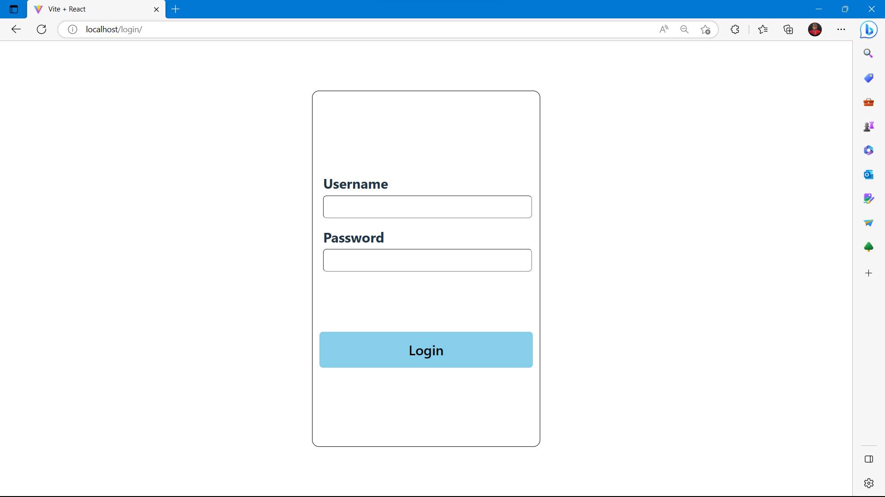
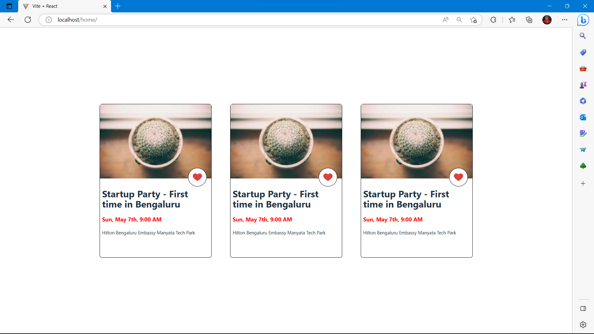

# Installation Steps

## Setting up enviroment variables
 

In order to run the application, you need to set the following enviroment variables. These enviroment variables are then used to provide crendentials to the application.
A list of enviroment variables which are necessary for the application to work are given below with their descriptions:

`DJANGO_SECRET_KEY`

This enviroment variable is used to set the secret key for your django application.

`MYSQL_USER='root'`

This enviroment variable is used to provide the username for the MySQL instance which the application will be accessing.

`MYSQL_PASSWORD`

This enviroment variable is used to provide the password for the same MySQL instance.

`MYSQL_DATABASE`

This enviroment variable is used to specify the database which will be used by django to handle migrations.

`MYSQL_HOST`

This enviroment variable is used to specify the host address of the MySQL instance.

`MYSQL_PORT`

This enviroment variable is used to specify the port on which the MySQL instance is running.

### Note: All the above mentioned enviroment variables need to be set for the application to work
 

# Screenshots

### Login Page

### Home Page
